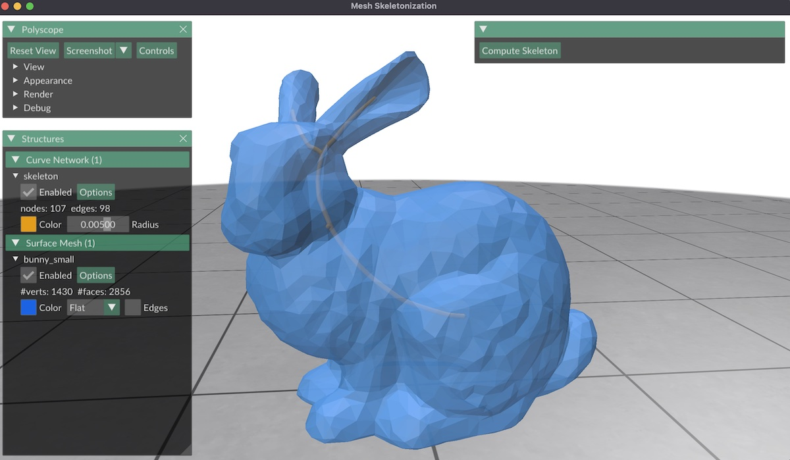

# Mesh Skeleton



This project takes in triangle meshes and uses the [CGAL library](https://www.cgal.org/) to compute their medial skeletons, while otherwise using [geometry-central](http://geometry-central.net/) for mesh processing and [polyscope](https://polyscope.run/) for visualization.

##  Getting started

You can clone this repo using
```
git clone --recursive git@github.com:MarkGillespie/MeshSkeleton.git
```
The `--recursive` flag tells git to also download the code for `geometry-central` and `polyscope` that this project depends on. If you forget the flag when you first clone the code, you can run the following command from inside the project to ask git to download those files.
```
git submodule update --init --recursive
```

This project uses C++ with [CMAKE](https://cmake.org/), and depends on the CGAL library. Instructions for getting both are provided below.

### Mac

On Mac, you can get a C++ compiler by installing XCode. If you want to run the compiler from the command line in order to use a different editor, you can run the following command in the command line.
```
xcode-select --install
```

You can then install CMAKE via
```
brew install cmake
```

and can install CGAL via
```
brew install cgal
```
More detailed instructions for cgal can be found [here](https://doc.cgal.org/latest/Manual/usage.html#secgettingcgal).

### Linux
On Linux, you can get a C++ compiler by running
```
sudo apt install build-essential
```

You can then install CMAKE via
```
sudo apt install cmake
```

and can install CGAL via
```
sudo apt install libcgal-dev
```
More detailed instructions for cgal can be found [here](https://doc.cgal.org/latest/Manual/usage.html#secgettingcgal).

### Windows
On Windows, you can install [Visual Studio](https://visualstudio.microsoft.com/) to get a C++ compiler and CMAKE support.

You should be able to install CGAL using vcpkg. CGAL provides more details [here](https://doc.cgal.org/latest/Manual/windows.html) and [here](https://www.cgal.org/download/windows.html).

## Compiling the code
On mac/linux, you can set up this project with the following commands.
```bash
git clone --recursive git@github.com:MarkGillespie/MeshSkeleton.git
cd MeshSkeleton
mkdir build
cd build
cmake -DCMAKE_BUILD_TYPE=RelWithDebInfo ..
make -j7
bin/run ../inputs/bunny_small.obj
```
On Windows, Visual Studio can use the provided CMake files to build and run the project.
